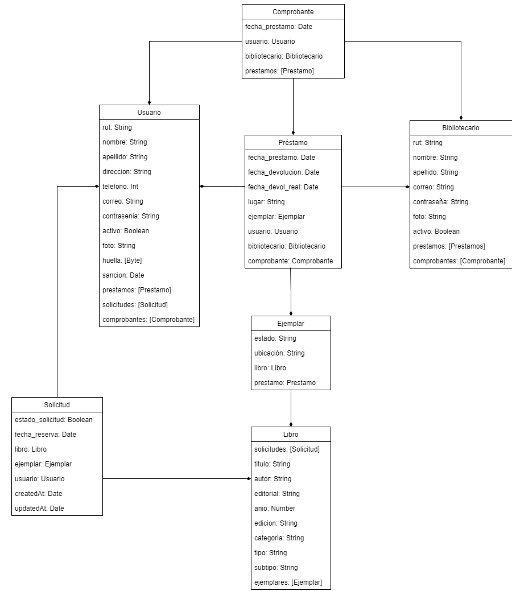

# Caso 16: Sistema de Préstamo en Biblioteca Municipal :books: 
La biblioteca de Estación Central (BEC) cuenta con una amplia colección de libros de todos los géneros literarios, además de una gran colección de documentos técnicos, lo que la transforma en un referente para los alumnos de colegios e instituciones de educación superior de la comuna, incluso prefiriéndola a las bibliotecas de sus correspondientes recintos estudiantiles. Desde hace un tiempo, la biblioteca también ha abierto sus puertas a los vecinos de la comuna.
Este recinto, además, cuenta con una extensa colección de multimedia incluyendo películas y documentales en formato de DVD y Blue Ray, además de variados registros auditivos (música, relatos, colección de sonidos, etc.).
Los bibliotecarios se encuentran capacitados para responder casi en la totalidad a las consultas de los usuarios de la biblioteca, por tener amplio conocimiento de la colección presente en las estanterías.

## Autores
* Pedro Mérida
* Javiera Villarroel

## Dependencias extras utilizadas
* graphql-iso-date
* node-schedule

## Pasos previos
1. Instalar dependencias
2. Cambiar credenciales de MongoDB en server.js
3. Correr "npm start"
4. Ir a localhost:8090/graphql

## Instalación utilizando npm/yarn
1. npm install -g nodemon
2. npm install -g yarn
3. yarn add mongoose
4. yarn add express
5. yarn add apollo-server-express
6. yarn add graphql
7. yarn add cors
8. yarn add lodash
9. yarn add body-parser
10. yarn add graphql-iso-date
11. npm install node-schedule

## Duración de los prestamos
* Libros en casa: 15 días
* Libros en sala: 5 horas
* Multimedia en casa: 7 días
* Multimedia en sala: 3 horas

## Sanciones
La sanción del usuario en caso de devolución con atraso corresponde a **el triple de tiempo del que se atrase**.

## Modelo

## Libros

### Modelo
* id: ID!
* titulo: String!
* autor: String!
* editorial: String!
* anio: Int
* edicion: String
* categoria: String (Biologia, Literatura, Física, etc.)
* tipo: String! (Libro o Multimedia)
* subtipo: String! (Literatura Juvenil, Literatura Española, etc, y en caso de multimedia, DVD, Blu-ray, etc.)
* ejemplares: [Ejemplar]
* solicitudes: [Solicitud]

### getLibros
Se muestran todos los libros de la biblioteca junto con su información

### getLibro
Se busca un libro por su ID y se muetra la información de dicho libro

### getLibrosCatalogo
Se busca un libro filtrando segun los siguiente parametros, cada uno es opcional y aceptan información incompleta (nombre incompleto de titulo, autor, etc):
* título: String
* autor: String
* categoria: String
Este retorna parte de la información del libro y además retorna cuantos ejemplares hay disponibles y cuantos hay en sala.

### addLibro
Se agrega un libro con los siguientes parámetros:
* titulo: String!
* autor: String!
* editorial: String!
* anio: Int
* edicion: String
* categoria: String
* tipo: String!
* subtipo: String!

### updateLibro
Se busca un libro por su ID y se actualiza su información. Se puede actualizar los siguientes parámetros:
* titulo: String
* autor: String
* editorial: String
* anio: Int
* edicion: String
* categoria: String
* tipo: String
* subtipo: String

### deleteLibro
Se busca un libro por su ID y se elimina.

## Ejemplares

### Modelo
* id: ID!
* estado: String! (Reservado, Sala Lectura, Sala Multimedia, Casa, Devuelto, Disponible)
* ubicacion: String (Estanteria en la que se encuentra por ejemplo A3)
* libro: Libro!
* prestamo: Prestamo

### addEjemplar
Agrega un ejemplar con los siguientes parámetros, donde por defecto su estado sera Disponible:
* ubicacion: String $\rightarrow$ Ubicación dentro de la biblioteca, por ejemplo, estanteria A1.
* libro: String! $\rightarrow$ ID del libro al cual corresponde el ejemplar.

### updateEjemplar
Se actualiza un ejemplar con el siguiente parámetro opcional
* ubicacion: String
Se hace la observación de que el estado de un ejemplar se actualiza solo cuando se crea o se libera un prestamo.

### deleteEjemplar
Elimina un ejemplar por su ID. Se elimina la referencia de este ejemplar dentro de Libro.

### getEjemplar
Se obtiene un ejemplar por su ID.

### getEjemplares
Se obtienen todos los ejemplares.

## Solicitudes

### Modelo
* id: ID!
* fecha_reserva: Date
* createdAt: Date
* updatedAt: Date
* estado_solicitud: Boolean (0 si no ha sido gestionada y 1 en caso contrario)
* libro: Libro!
* ejemplar: Ejemplar!
* usuario: Usuario!

### getSolicitudes
Se muestran todas las solicitudes de libros hechas junto con su información.

### getSolicitud
Se busca una solicitud por su ID y se muetra la información de esta.

### getSolicitudEstado
Se buscan solicitudes de acuerdo a su campo de "Estado solicitud" y se muestran en pantalla, esto para saber que solicitudes estan pendientes por gestionar y cuales no (False si es que aun hay que gestionarla y True si es que no)

### addSolicitud
Se agrega una solicitud solicitando los siguientes parámetros:
* ID del usuario solicitador
* id_libro: String! $\rightarrow$ ID del libro solicitado
* id_usuario: String! $\rightarrow$ ID del usuario que solicita
* fecha_reserva: Date! $\rightarrow$ Fecha para la cual quiere reservar el libro

Las fechas de creación y actualización son generadas automaticamente y el estado, cuando es creada la solicitud, es por defecto False.

### updateSolicitud
Se busca una solicitud por su ID y se pueden actualizar los siguientes parámetros:
* estado_solicitud: Boolean
* ejemplar: String
La fecha de actualización se actualiza automaticamente.

### deleteSolicitud
Se busca una solicitud por su ID y se elimina, ademas dicha solicitud también se elimina de la lista de solicitudes del usuario y del libro.

## Prestamos

### Modelo
* id: ID!
* fecha_prestamo: Date
* fecha_devolucion: Date
* fecha_devol_real: Date
* lugar: String (Sala de lectura, Sala multimedia o Casa)
* ejemplar: Ejemplar!
* usuario: Usuario!
* bibliotecario: Bibliotecario!

### addPrestamo
Se agrega un préstamo con los siguientes parámetros obligatorios:
* fecha_prestamo: Date
* Fecha de devolución (Generada automáticamente)
* lugar: String! $\rightarrow$ Lugar a donde se lleva el préstamo (Sala de lectura, Sala multimedia o Casa)
* ejemplar: String! $\rightarrow$ ID del ejemplar prestado
* usuario: String! $\rightarrow$ ID del usuario al que se le realiza el préstamo
* bibliotecario: String! $\rightarrow$ ID del bibliotecario que gestiona el préstamo
Al agregar un préstamo, se agrega la referencia del préstamo a Usuario y Bibliotecario (como listas de Préstamos), además, se agrega la referencia a Ejemplar y se actualiza el estado del ejemplar con el valor del lugar donde se lleve el préstamo.
  
### updatePrestamo
Actualiza el préstamo con el parámetro:
* fecha_devol_real: Date $\rightarrow$ Fecha de devolución real.
Por lo tanto, solo se actualiza el prestamo cuando **este es devuelto**.
Consideraciones:
* Al actualizar, se libera el ejemplar eliminando la referencia de Préstamo dentro de Ejemplar
* El estado del ejemplar se actualiza a *Devuelto*. Luego de 30 minutos de entregar el prestamo, se actualiza el ejemplar a **Disponible**, haciendo uso de node-schedule.

### deletePrestamo
Se elimina el préstamo según ID. Se elimina la referencia de Préstamo en Ejemplar, Usuario y Bibliotecario.

### getPrestamos
Se obtiene todos los préstamos

### getPrestamo
Se obtiene el préstamo según su ID

### getComprobante
Para cumplir con el requisito funcional *"Una vez ingresado el préstamo a domicilio se debe generar un comprobante que indique cada uno de los documentos en préstamo más la fecha/hora de devolución para cada uno de ellos (considerando que no todos los documentos tienen el mismo plazo de préstamo)."* se consideró lo siguiente:
* En la interfaz para el bibliotecario se permitirá agregar varios ejemplares a un préstamo
* De esta forma, cuando el bibliotecario complete el formulario, el controlador generará una misma fecha de préstamo para todos los ejemplares ingresados, fecha que se enviará al backend para cada ejemplar.
* Asumiremos que la fecha (con milisegundos) será única para cada comprobante.
* Finalmente, para obtener el comprobante de préstamo, se debe ingresar la fecha para obtener todos los préstamos (por ejemplar) que realizó en dicha fecha.

### getPrestamosVencidos
Se ingresa un lugar: String para obtener los préstamos vencidos, ya sea en Sala Lectura, Sala Multimedia, Casa, etc, y se retorna los préstamos vencidos en ese momento (fecha actual) en el lugar ingresado. Se retorna los siguientes datos del préstamo:
* id_prestamo: ID
* fecha_devolucion: Date
* lugar: String
* duration: Int
* unit: String
La unidad será en días si el lugar es en Casa, y en horas si el lugar es en Sala.

## Usuarios

### Modelo
* id: ID!
* rut: String!
* nombre: String!
* apellido: String!
* direccion: String!
* telefono: Int!
* correo: String!
* contrasenia: String
* activo: Boolean! (0 si es que la cuenta del usuario no esta activa, 1 en caso contrario)
* foto: String (Direccion en la que se encuentra la foto)
* huella: [Boolean]
* sancion: Date (null si es que el usuario no tiene una sanción por atraso, una fecha en caso contrario)
* prestamos: [Prestamo]
* solicitudes: [Solicitud]

### addUsuario
Se agrega un usuario con los siguientes parámetros, donde por defecto no se encuentra activo. Todos los campos son obligatorios a excepción de la ruta de foto de perfil y huella digital.
* rut: String!
* nombre: String!
* apellido: String!
* direccion: String!
* telefono: Int!
* correo: String!
* contrasenia: String!
* foto: String $\rightarrow$ Este campo contiene la ruta donde se encuentra la foto de perfil
* huella: [Boolean]

### updateUsuario
Actualiza un usuario según los siguientes parámetros opcionales:
* rut: String
* nombre: String
* apellido: String
* direccion: String
* telefono: Int
* correo: String
* contrasenia: String
* activo: Boolean
* foto: String
* huella: [Boolean]

### deleteUsuario
Elimina un usuario según su ID. Elimina la referencia del Usuario en Préstamo y Solicitud. 
**No se aconseja su uso, solo en casos extremos. Para dar de baja un usuario, lo ideal es actualizar su estado de activo.** Esto con la finalidad de no perder la referencia del usuario en caso de que tenga préstamos asociados.

### getUsuario
Obtiene un usuario según su ID.

### getUsuarios
Obtiene todos los usuarios del sistema.

## Bibliotecario

### Modelo
* id: ID!
* rut: String!
* nombre: String!
* apellido: String!
* correo: String!
* contrasenia: String
* foto: String
* activo: Boolean! (0 si es que el bibliotecario no esta activo o fue dado de baja, 1 en caso contrario)
* prestamos: [Prestamo]

### addBibliotecario
Agrega un bibliotecario al sistema con los siguientes parámetros, donde por defecto el bibliotecario se encuentra activo:
* rut: String!
* nombre: String!
* apellido: String!
* correo: String!
* contrasenia: String
* foto: String

### updateBibliotecario
Actualiza un bibliotecario según los siguientes parámetros opcionales:
* rut: String
* nombre: String
* apellido: String
* correo: String
* contrasenia: String
* foto: String
* activo: Boolean

### deleteBibliotecario
Elimina un bibliotecario por su ID. En caso de tener préstamos asociados, se elimina la referencia de Bibliotecario en Préstamo. 
**No se aconseja su uso, solo en casos extremos. Para dar de baja un bibliotecario, lo ideal es actualizar su estado de activo.** Esto con la finalidad de no perder la referencia del bibliotecario en caso de que tenga préstamos asociados.
